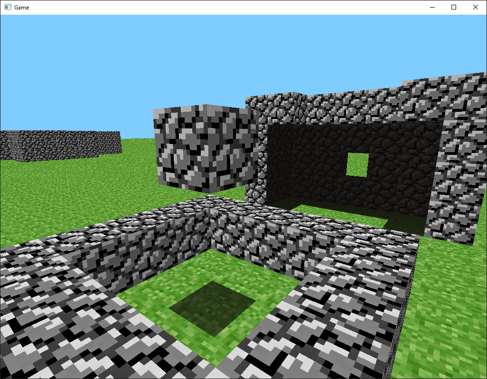
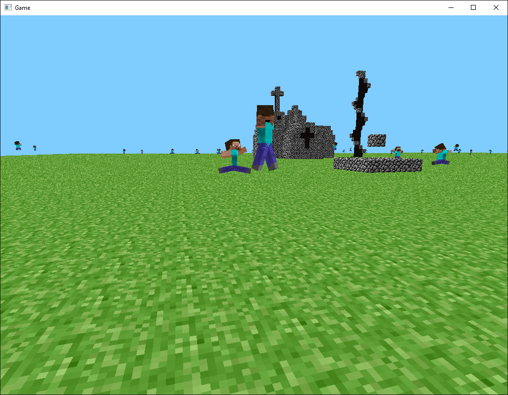

# Minecraft Pre-Classic Rust Clients

This is a reimplementation of Minecraft's original test versions made available in today's launcher using the Rust programming language.

## rd-132211

## rd-132328

## rd-160052
WIP

## rd-161348
WIP